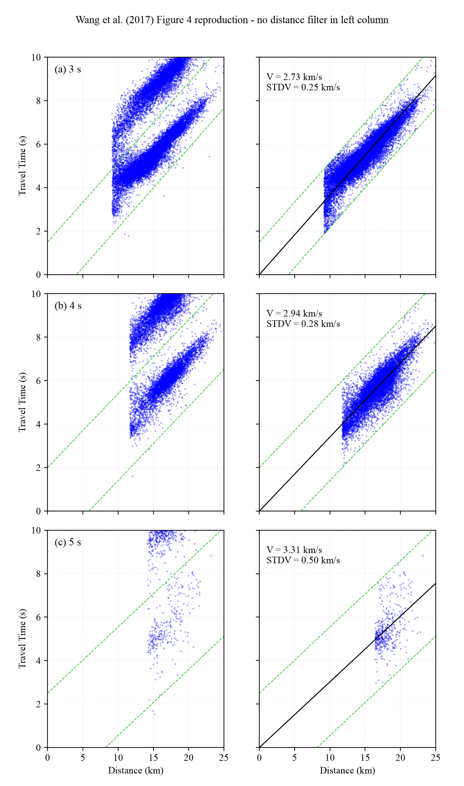

# FTAN_Wang：Wang et al. (2017) 图4的 FTAN 处理与重绘

本目录保存 Mount St. Helens 环境噪声数据的 FTAN（频率—时间分析）代码、
Wang et al. (2017) 图4的最新重绘脚本，以及最终 PNG。图中使用 3、4、5 s
Rayleigh 波相位走时与台间距的关系来说明：原始相位走时会因 `2π` 相位模糊而
分成数个散点簇；完成整数周期校正后，散点可合并到同一条主趋势上。



> 本仓库不上传原始台站互相关、`.dat` 文件和完整 `pair_results.jsonl`：其中后者
> 约 18 GB，仍保留在 `work` 服务器。下文给出完整路径、字段和生成关系，便于
> 在有权限的服务器上复现。

## 目录内容

```text
FTAN_Wang/
├── code/
│   ├── bensen_phase_ftan.py
│   ├── run_work_reproduce_wang_figure4_allpairs.py
│   ├── wang_ftan_validation.py
│   ├── check_egf_vs_ccf_phase.py
│   └── rebuild_wang_figure4_egf_no_preleft.py
├── figure/
│   └── wang_figure4_egf_no_preleft_wang_aspect_times.png
└── README.md
```

| 文件 | 作用 |
| --- | --- |
| `bensen_phase_ftan.py` | FTAN 滤波、群速度脊线追踪、相位拾取、瞬时周期、Wang SNR/群速度质控、目标周期插值、整数周期校正等核心函数。 |
| `run_work_reproduce_wang_figure4_allpairs.py` | 对全部台对执行 Stage-B FTAN，写出各台对的测量、拒绝原因和图4所需中间数据。 |
| `wang_ftan_validation.py` | FTAN 运行器调用的输入、数值和结果验证工具。 |
| `check_egf_vs_ccf_phase.py` | 在波形层面对比 CCF 与 EGF 相位，验证本图使用的 `+T/4` 时间换算。 |
| `rebuild_wang_figure4_egf_no_preleft.py` | 最新图4绘制程序：左列不施加一波长台距筛选；右列沿用已确认的相位校正和一波长筛选。 |
| `figure/*.png` | 最新输出：Times New Roman 字体、Wang 原图的纵向子图比例，以及每个面板仅保留主簇上下两条绿色虚线。 |

## 输入数据：从原始互相关到图4散点

### 1. 台对互相关 `.dat` 文件

Stage-B FTAN 的原始输入位于 `work` 服务器：

```text
/mnt/data_hdd/lgx/MSH_ANT/outputs/reports/
wang_disperpicker_fig4_xmlcoords_allpairs_unspiked_20260702/dat_all/*.dat
```

每个文件对应一个台对，文件开头给出两个台站的经纬度，随后是用于 FTAN 的
互相关波形。运行器从正、负延迟分支构造对称波形，并根据台站坐标计算：

- `pair_name`：台对名称；
- `distance_km`：大圆台间距（km）；
- `azimuth_deg`：方位角；
- 波形采样间隔、最大延迟和样点数。

### 2. 全台对 FTAN 结果

运行 `run_work_reproduce_wang_figure4_allpairs.py` 后，实验目录为：

```text
/mnt/data_hdd/lgx/MSH_ANT/experiments/wang_ftan_dat_20260724/
fixed_bensen_alpha12_b1_b2_1/
```

其中与图4直接相关的文件如下：

| 文件 | 含义 |
| --- | --- |
| `pair_results.jsonl` | 每一个台对的完整 FTAN 处理记录；包括成功结果、失败阶段和拒绝原因。体积约 18 GB。 |
| `target_measurements.jsonl` | 已通过 FTAN 与左列基本质控、并插值到目标周期的测量集合。是左列的基础输入。 |
| `figure4/measurements_corrected.csv` | 相位整数周期校正后的记录，用于审计。 |
| `figure4/fit_summary.csv` | 各周期的参考速度、右列拟合速度、标准差和点数。 |

`target_measurements.jsonl` 的每行是“一个台对 + 一个目标周期”，典型字段包括：

`pair_name`、`distance_km`、`period_s`、`group_time_s`、
`group_velocity_km_s`、`raw_travel_time_s`、`leading_snr`、`trailing_snr`、
`signal_peak`、`leading_noise_rms`、`trailing_noise_rms`、`source/receiver` 坐标，
以及脊线能量、相邻速度跳跃和插值支撑点数等诊断量。

### 3. 图4重绘所读的三个数据文件

最新绘图程序在下列目录中读取数据：

```text
/mnt/data_hdd/lgx/MSH_ANT/experiments/wang_ftan_dat_20260724/
├── fixed_bensen_alpha12_b1_b2_1/target_measurements.jsonl
├── egf_convention_check/measurements_corrected.jsonl
├── egf_convention_check/metadata.json
└── egf_convention_check_no_preleft/short_measurements.jsonl
```

- `target_measurements.jsonl`：左列的主体测量。
- `short_measurements.jsonl`：对短台距台对单独重跑得到的补充记录。绘图时以
  `(pair_name, period_s)` 去重，只补充主体文件中缺少的台对—周期记录。
- `measurements_corrected.jsonl`：原图右列已经完成相位校正的记录；最新绘图脚本
  直接读取它，因此右列的点、拟合速度和标准差不因左列重绘而改变。
- `metadata.json`：读取每个周期的参考相速度 `Vref`、右列拟合速度和标准差。

## FTAN 与左列基本质控

FTAN 首先在 2.5–5.0 s 的周期范围内追踪基阶群速度脊线，再估计相位、瞬时周期
并把连续测量插值到 3.0、3.5、4.0、5.0 s。图4只画 3、4、5 s。

一个目标周期测量进入左列，必须同时满足以下条件：

1. **FTAN 测量有效**：基阶脊线、群到时、相位和瞬时频率均有效；不能是重复的
   瞬时周期点。
2. **能够插值到目标周期**：目标周期两侧至少有足够的有效连续测量；否则状态为
   `target_period_not_bracketed`，不进入图4。
3. **两侧噪声窗 SNR 都大于 4**：`leading_snr > 4` 且 `trailing_snr > 4`。SNR 为
   滤波波形的信号峰值除以前、后噪声窗的 RMS；每个噪声窗至少需要 8 个样点。
4. **群速度范围正确**：下限均为 1.6 km/s；当周期 `< 4.5 s`（本图的 3、4 s）
   上限为 3.0 km/s；当周期 `≥ 4.5 s`（本图的 5 s）上限为 3.3 km/s。

**重要：左列没有 `distance ≥ Vref × T` 的一波长台距条件。** 因而“左列全部散点”
的准确意思是：保留所有已经通过上述 FTAN、SNR、群速度和目标周期插值条件的点，
而不是把完全无效的原始波形也画出来。

## 从 CCF 相位到 EGF 相位

FTAN 归档中的 `raw_travel_time_s` 是 Bensen CCF 相位约定下的时间。为了与 Wang
图4采用的 EGF 相位约定一致，绘图时对左列每一个点使用：

```text
t_EGF = raw_travel_time_s + T / 4
```

`check_egf_vs_ccf_phase.py` 用波形层面的比较验证了这一个 `+T/4` 移动。这里的
`T` 是该散点对应的周期（3、4 或 5 s）。

## 图4两列散点的含义

### 左列：原始相位走时散点

- 横轴：台间距 `D`（km）；纵轴：EGF 相位走时 `t_EGF`（s）。
- 每个蓝点是一个通过左列基本质控的“台对—周期”测量。
- 左列仍含有 `2π` 相位模糊：相位多加或少加一个完整周期 `T`，会使走时整体上、
  下移动 `T` 秒。因此同一速度趋势会表现为多簇近似平行的蓝色散点。
- 图中的两条绿色虚线只围住选定的主簇：

  ```text
  t = D / Vref − T/2
  t = D / Vref + T/2
  ```

  它们是“主簇允许的半周期范围”，不是台间距筛选线，也不是额外删除左列散点的
  条件。此前更远的 `±3T/2` 绿色线已删除。

### 右列：相位周期校正并筛选后的散点

右列处理每个左列测量的步骤为：

1. 先利用每个周期的参考速度 `Vref` 预测走时 `D / Vref`；
2. 为该点选取整数周期数 `N`，使校正后的走时

   ```text
   t_corrected = t_EGF + N × T
   ```

   尽可能接近参考走时，并使剩余误差落在 `±T/2` 内；
3. 只保留一波长以外的点：

   ```text
   D ≥ Vref × T
   ```

   这一步只用于右列；
4. 对保留下来的 `(D, t_corrected)` 做过原点的最小二乘直线拟合。黑线为拟合线，
   其斜率为慢度，拟合相速度为斜率的倒数。

右列中的 `V` 为该周期的拟合相速度（km/s）；`STDV` 为各校正后单点相速度
`D / t_corrected` 的标准差（km/s）。右列比左列集中，是因为不同的整数周期分支
被合并到了同一主趋势，且短于一波长的点被删除。

## 重绘产生的文件

在服务器执行 `rebuild_wang_figure4_egf_no_preleft.py` 后，输出目录为：

```text
/mnt/data_hdd/lgx/MSH_ANT/experiments/wang_ftan_dat_20260724/
egf_convention_check_no_preleft/
```

| 输出文件 | 内容 |
| --- | --- |
| `wang_figure4_egf_no_preleft.png` | 最新图4 PNG：Times New Roman、面板高宽比 1.23、左列无一波长台距筛选、右列保持原筛选。 |
| `left_measurements_no_preleft.jsonl` | 最终实际绘入左列的测量记录，可逐点审计。 |
| `fit_summary.csv` | 3、4、5 s 的左/右点数、`Vref`、右列拟合速度和标准差。 |
| `metadata.json` | 本次图的输入 SHA-256、左右列含义和汇总数值。 |
| `short_measurements.jsonl` | 单独处理的短台距补充记录。 |
| `short_reprocess_metadata.json` | 短台距补处理的参数、台对数与各周期接受数。 |

当前最终图片也以
`figure/wang_figure4_egf_no_preleft_wang_aspect_times.png` 的形式保存于本目录。

## 在 `work` 服务器重绘

脚本默认使用上文列出的绝对路径。需要 Python、NumPy、Matplotlib，以及一份
合法安装或持有的 Times New Roman `.ttf` 字体文件。字体文件不随本仓库发布。

```bash
cd /mnt/data_hdd/lgx/MSH_ANT/experiments/wang_ftan_dat_20260724/
egf_convention_check_no_preleft

/mnt/data_hdd/lgx/MSH_ANT/.venvs/2014_wang_pws/bin/python \
  rebuild_wang_figure4_egf_no_preleft.py \
  --font-path '/path/to/Times New Roman.ttf'
```

如果在其他机器运行，需要以 `--root` 指向拥有相同目录结构和上述 JSONL 输入的
实验根目录，并以 `--output-dir` 指向含 `short_measurements.jsonl` 的输出目录。
右列不应重新混入未经审计的记录；它依赖
`egf_convention_check/measurements_corrected.jsonl` 中已经确认的周期校正结果。
