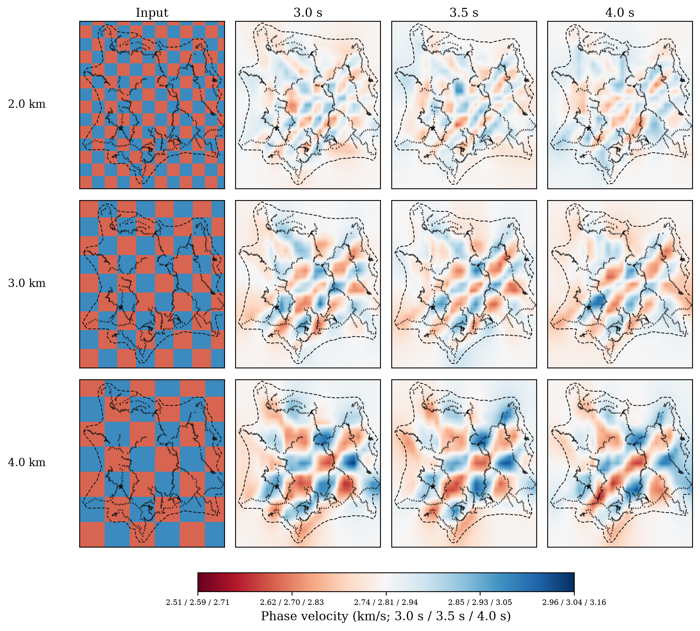

# Wang Figure 9 二维相速度反演与棋盘格分辨率测试

本目录保存 Mount St. Helens 环境噪声面波数据的 Wang et al. (2017) 风格二维相速度反演代码、方位校正结果，以及用于评估空间分辨率的棋盘格测试。当前实现使用 `egf_convention_check` 的相速度测量，在 3.0、3.5、4.0 s 三个周期分别反演。

目录中的脚本与服务器报告 `wang_fig9_resolution_tests_km_2_3_4_20260727` 对应；提交的图是由 Python/NumPy/SciPy/Matplotlib 生成的可复现结果，不是人工绘图或 AI 图像。

## 目录内容

```text
Wang_1D/
├── code/
│   ├── aant_2014_phase_maps.py
│   ├── local_phase_velocity_maps.py
│   ├── plot_wang_fig9_azimuthal_correction.py
│   ├── run_fig9_resolution_tests.py
│   ├── render_fig9_checkerboard_km_comparison.py
│   ├── replot_wang_figure6_colormap.py
│   └── plot_wang_fig5_fig6_from_disperpicker.py
├── figures/
│   ├── wang_figure8_style_azimuthal_residual_fit.png
│   ├── wang_figure9_style_phase_velocity_maps_azimuthal_corrected.png
│   ├── wang_figure6_vs_figure9_before_after_comparison.png
│   └── checkerboard_recovery_by_period_km_2_3_4.png
└── README.md
```

| 文件 | 作用 |
| --- | --- |
| `plot_wang_fig9_azimuthal_correction.py` | 主处理入口：方位残差拟合、走时校正、三周期二维慢度反演和 Figure 8/9 风格成图。 |
| `local_phase_velocity_maps.py` | 构建路径长度矩阵、正则化矩阵，执行鲁棒最小二乘慢度反演。 |
| `aant_2014_phase_maps.py` | 台站坐标、测地距离和网格/射线路径辅助函数。 |
| `run_fig9_resolution_tests.py` | 原始网格上的参数扫描、棋盘格、火山口异常和点扩散函数（PSF）分辨率测试。 |
| `render_fig9_checkerboard_km_comparison.py` | 本次 2.0/3.0/4.0 km 物理正方形棋盘格的专用重算与展示脚本。 |
| `figures/checkerboard_recovery_by_period_km_2_3_4.png` | 本次最终棋盘格恢复图。 |

## 最终棋盘格结果



图中第一列是人为设定的输入模型，后三列是将模拟走时送入与真实数据相同的反演流程后得到的恢复结果。

- 每一行的棋盘格边长依次为 2.0、3.0、4.0 km；它们按真实地表距离定义，而不是按经纬度网格单元数定义。
- 黑色三角形为 896 个台站位置。少数位于反演边界外侧的台站在图框处被裁剪，但台站清单没有被删除。
- 黑色虚线为射线密度 `ray_count = 20` 的边界；虚线内通常具备更可靠的恢复能力。
- 低速为红色，高速为蓝色。所有子图使用同一 `RdBu` 颜色方向，Input 与恢复图的颜色方向一致。
- 为使不同周期的背景保持白色，绘图颜色按各周期相对于其参考速度的变化居中；色标刻度则同时列出相同颜色在 `3.0 s / 3.5 s / 4.0 s` 下对应的真实相速度（km/s）。例如色标左端红色对应低速，右端蓝色对应高速。

> 棋盘格测试不是在证明地下存在棋盘格，而是在检验：若地下存在某一尺度的速度变化，现有台站几何、路径覆盖、噪声水平和正则化设置能否将其恢复出来。

## 二维相速度反演：从测量到速度图

### 1. 输入测量与周期选择

输入 CSV 的每一条记录至少需要包含台站对、两台站坐标、路径距离、目标周期相速度或等价走时信息。处理只选择 3.0、3.5、4.0 s 三个目标周期的合格记录。每个周期独立处理，因为可用路径、参考速度、噪声和覆盖范围都可能不同。

对每条台站对路径，脚本计算或读取：

1. 源点与接收点坐标；
2. 测地距离与路径方位；
3. 该周期的相速度 `c_i` 与走时 `t_i = L_i / c_i`；
4. 路径落在反演边界内的有效长度；过短的内部路径由 `min_inside_km` 剔除。

### 2. 方位走时残差校正

密集台阵的路径方向分布并不均匀。若走时残差随传播方位系统性变化，直接反演会把方位效应误认为空间速度异常。`plot_wang_fig9_azimuthal_correction.py` 对每一个周期执行以下步骤。

1. 用常数参考速度拟合走时，并计算残差：

   ```text
   r_i = t_i - L_i / c_ref
   ```

2. 将方位折叠到 0–180°；对于互相关对，方位 `θ` 与 `θ + 180°` 表示同一条无方向路径。
3. 按 20° 方位箱计算残差均值，并按每个箱内样本数加权。
4. 对方位残差拟合二阶和四阶 Fourier 项：

   ```text
   f(θ) = a + b cos(2θ) + c sin(2θ) + d cos(4θ) + e sin(4θ)
   ```

5. 从所有原始走时中扣除该项：

   ```text
   t_corrected = t_observed - f(θ)
   ```

校正后的走时和相速度会写入输出数据表，再用于二维反演。Figure 8 风格图展示了校正前后方位残差及 Fourier 拟合；Figure 9 风格图展示校正后的相速度场。

### 3. 反演网格与射线长度矩阵

研究区域使用规则经纬度网格；本次棋盘格计算的间距为 `0.01°`，得到 `25 × 30` 个反演单元。每条台站对的直线路径以 `0.25 km` 间隔采样，并将落在每个网格单元内的路径长度累计为矩阵 `G` 的元素：

```text
G[i, j] = 第 i 条路径在第 j 个网格内的长度（km）
```

同一几何还用于计算每个单元被多少条路径穿过的 `ray_count`。它是覆盖质量指标，不是速度值。

### 4. 参考慢度与观测方程

每个周期的参考速度取裁剪后有效路径相速度的中位数 `c_ref`，参考慢度为：

```text
s_ref = 1 / c_ref
```

把观测走时减去均匀参考慢度预测的走时，可得数据向量：

```text
d = t_observed - G s_ref
```

待求模型 `m` 是每个网格单元相对于参考慢度的扰动。基本关系为：

```text
d ≈ G m
```

求得慢度后再转换成相速度：

```text
c = 1 / (s_ref + m)
```

因此反演本质上是先解慢度，再以非线性倒数形式转换为速度；不能把慢度扰动直接当作速度扰动。

### 5. 阻尼、平滑和鲁棒最小二乘

单纯求解 `Gm = d` 会因路径分布不均而不稳定。代码构造阻尼项和一阶差分平滑项，求解增广系统：

```text
minimize ||W (Gm - d)||² + ||R m||²
```

其中：

- `W` 是鲁棒残差权重；
- `R` 由模型阻尼和相邻网格的一阶差分平滑组成；
- 阻尼抑制无数据区域出现过大的慢度扰动；
- 平滑抑制相邻单元之间不合理的剧烈跳变。

计算使用 SciPy `lsqr`。真实数据反演进行 4 次鲁棒迭代：残差离群的路径会在下一轮获得较小权重。棋盘格的合成反演仅进行 1 次普通最小二乘，以隔离几何、噪声和正则化对恢复的影响。

本次棋盘格采用的基准参数为：

| 参数 | 值 |
| --- | ---: |
| 阻尼 `damping` | 8.0 |
| 平滑 `smoothing` | 22.0 |
| 真实数据鲁棒迭代 | 4 |
| 合成数据鲁棒迭代 | 1 |
| 路径采样间隔 | 0.25 km |
| 网格间距 | 0.01° |

`run_fig9_resolution_tests.py` 还可扫描多组阻尼/平滑参数，并在 `ray_count >= 20` 的网格内用相关系数和振幅斜率评价恢复效果。

### 6. 速度图解释边界

反演图上有颜色并不等于该处就有可信速度异常。解释时至少应同时检查：

1. 射线是否充分覆盖该位置；
2. 不同周期是否有相互支持的空间特征；
3. 同一特征是否在合理的阻尼/平滑范围内保持稳定；
4. 棋盘格测试能否恢复与该特征相近的尺度和位置。

虚线以 `ray_count = 20` 标示覆盖边界。虚线外的结构可能主要受正则化和边界条件控制，应避免进行强地质解释。

## 棋盘格测试的详细过程

### 测试目标

棋盘格测试评价的是反演系统的空间分辨率，而不是拟合真实地质模型。它回答四个问题：

1. 当前台站与路径几何能否分辨 2、3、4 km 尺度的异常？
2. 恢复结构是否保持正确的位置、正负号和相对形状？
3. 平滑和阻尼会把多小的结构抹平或错位？
4. 哪些区域由于覆盖不足而不能可靠恢复？

### 1. 构造物理正方形输入模型

`render_fig9_checkerboard_km_comparison.py` 不使用“2 × 2 网格”这类会随纬度改变实际尺寸的定义，而是从反演区域西南角开始，将每个位置转换为东西向和南北向距离（km）。对于边长 `a`，输入慢度分数扰动定义为：

```text
q(x, y) = +0.05 或 -0.05
```

其符号由 `floor(x/a) + floor(y/a)` 的奇偶性交替决定。测试依次使用：

```text
a = 2.0 km, 3.0 km, 4.0 km
```

`+0.05` 是慢度增加 5%，对应较低相速度；`-0.05` 是慢度减少 5%，对应较高相速度。为避免第一列因粗网格显示而看起来不方，输入棋盘格以高分辨率物理 km 栅格渲染；这不改变送入反演的 `25 × 30` 模型值。

### 2. 保留真实观测几何

测试没有人为均匀布设路径。它直接复用每个周期真实数据的：

- 台站位置；
- 台站对路径；
- 反演边界；
- 网格；
- 路径裁剪规则；
- 路径矩阵 `G`；
- 射线密度 `ray_count`。

因此测试结果反映的是这套 896 台站、当前有效路径选择和当前反演设置下的实际分辨率，而不是理想化台网的能力。

### 3. 生成合成走时

对每个周期和每个棋盘格模型，将真实慢度分数扰动 `q` 转换为慢度扰动：

```text
δs_true = q × s_ref
```

再用真实路径矩阵生成合成数据：

```text
d_synthetic = G δs_true + ε
```

其中 `ε` 是零均值高斯噪声。默认噪声标准差取同周期真实数据反演残差的 MAD 估计，因此不同周期保留各自的实际噪声水平。

本次运行的参考相速度约为：

| 周期 | 参考相速度 |
| --- | ---: |
| 3.0 s | 2.7361 km/s |
| 3.5 s | 2.8132 km/s |
| 4.0 s | 2.9395 km/s |

### 4. 用完全相同的正则化反演合成数据

合成数据不把答案直接放回网格，而是送入与真实数据相同的路径矩阵、阻尼和平滑系统。这样，图中模糊、振幅减弱、边界畸变或异常错位都是真实反演配置会造成的影响，而不是显示效果。

输出的恢复慢度分数扰动再转换为相速度。绘图时以每个周期的参考相速度为白色中心；低速相对于参考值的变化为红色，高速变化为蓝色。

### 5. 图的读法

按行比较 Input 与后三列：

- 若红蓝交替的符号、位置和尺度大体正确，说明该区域能分辨该尺度；
- 若棋盘格只剩零散色块，说明恢复能力不足；
- 若颜色明显向一侧拖曳，通常反映路径方向不均匀或平滑造成的展宽；
- 若恢复只出现在虚线内，应把解释限制在该覆盖区域；
- 2 km 一行通常是最严格的测试，4 km 一行通常更易恢复。

不要把虚线外的零散颜色、或只在一个周期出现的细小色块直接解释为地下真实异常。

### 6. 色标的含义

图面颜色是相对于本周期参考速度的快慢变化，以便三个周期的背景都保持白色、可直接比较结构形态。但色标下方给出的数字不是 `-0.2` 这类无量纲符号，而是真实相速度，单位为 km/s。

每个刻度显示三个值，顺序固定为：

```text
3.0 s / 3.5 s / 4.0 s
```

例如图中一个刻度 `2.74 / 2.81 / 2.94` 表示：在 3.0、3.5、4.0 s 三列中，该颜色分别对应约 2.74、2.81、2.94 km/s。这样既保留了白色参考背景，也避免把不同周期的真实基准速度混成同一个绝对数值。

## 可复现运行

### Python 依赖

需要 Python 3、NumPy、SciPy、Matplotlib；读取 CSV 时使用标准库 `csv`，主反演流程的部分脚本还使用 pandas。服务器运行使用的环境为：

```text
/mnt/data_hdd/lgx/MSH_ANT/.venvs/2014_wang_pws/bin/python
```

### 输入文件

当前服务器默认路径为：

```text
测量 CSV:
/mnt/data_hdd/lgx/MSH_ANT/experiments/wang_ftan_dat_20260724/
egf_convention_check/measurements_fig56_egf.csv

台站 CSV:
/mnt/data_hdd/lgx/MSH_ANT/outputs/reports/
wang_fig9_azimuth_corrected_egf_convention_20260724/data/stations.csv
```

迁移到其他主机时，应通过命令行参数显式给出本机路径，而不是修改脚本默认值。

### 重算当前棋盘格图

在本目录的 `code/` 中执行：

```bash
python render_fig9_checkerboard_km_comparison.py \
  --measurements-csv /path/to/measurements_fig56_egf.csv \
  --stations-csv /path/to/stations.csv \
  --output-dir /path/to/wang_fig9_resolution_tests_km_2_3_4 \
  --checkerboard-sides-km 2.0 3.0 4.0 \
  --checker-amplitude 0.05 \
  --damping 8 \
  --smoothing 22 \
  --grid-spacing-deg 0.01 \
  --sample-step-km 0.25 \
  --robust-iterations-real 4 \
  --dpi 300
```

若目标目录已存在并且确认只覆盖本次棋盘格输出，可追加 `--overwrite`。脚本会生成：

```text
figures/checkerboard_recovery_by_period_km_2_3_4.png
data/checkerboard_km_recovery_data.npz
summary.json
```

`summary.json` 记录实际参考速度、残差噪声、台站数、周期、棋盘格边长、阻尼和平滑参数；`NPZ` 保存输入/恢复模型、覆盖计数和台站坐标，便于后续定量评价或重新绘图。

### 运行更完整的分辨率测试

需要执行阻尼/平滑扫描、原始网格棋盘格、火山口异常和 PSF 时，使用：

```bash
python run_fig9_resolution_tests.py --help
```

该脚本的参数扫描以 `ray_count >= 20` 的单元为评价区域，并输出模型相关系数、振幅恢复斜率和对应图件。与本 README 顶部的最终图相比，它更适合选择正则化参数和分析不同测试模型的分辨率。

## 结果使用时的限制

1. 棋盘格恢复只说明在所设定的幅度、噪声和模型尺度下的可恢复性；真实异常若更弱、形状不同或位于覆盖外，恢复能力会降低。
2. 直线路径与二维表面波近似是本实现的前提；复杂三维传播、散射和未建模的路径效应可能使真实数据表现更差。
3. 三个周期采样的有效深度和波长不同。跨周期比较应关注空间趋势是否一致，不应把任一单一周期的细小色块当作独立结论。
4. 图像的显示平滑仅用于提高阅读性；分辨率判断应以输入/恢复关系、覆盖边界和保存的原始网格结果为准。
